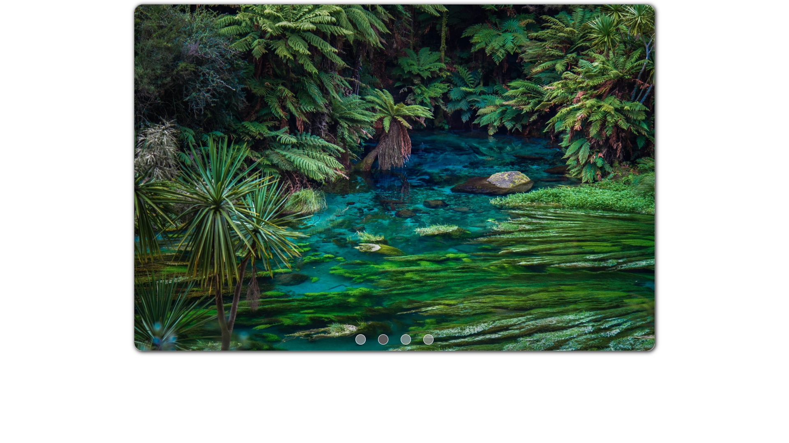

# Slideshow

Przykładowy skrypt umożliwiający zamianę serii zdjęć w automatyczny pokaz slajdów. Dodatkowo skrypt umożliwia ręczną zmianę aktualnego obrazu.

Sample script for turning a series of images into an automatic slideshow. Additionally the script allows you to manually change the current image.

## Demo

https://piotrhol.github.io/Slideshow/

## Technologies

HTML, Sass, JavaScript, Webpack

## Example screenshot

- Main view

